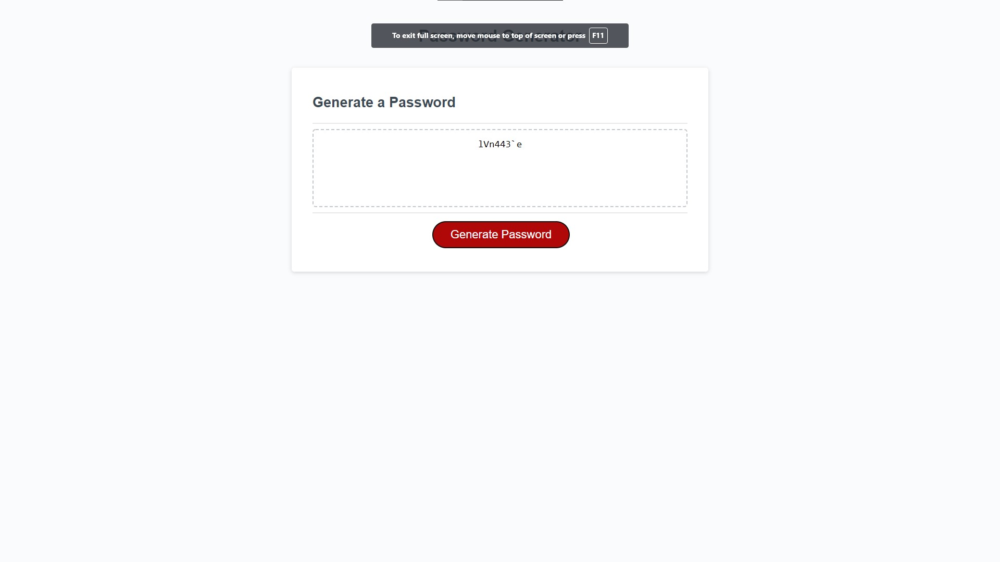

# Password Generator 

## Purpose:
User's may use this website to create/generate passwords within the set margin given. This is a browser application that features HTML and CSS and is powered by JavaScript code. It has a clean interface that is not only responsive but adapts to multiple different display settings.

## Description:
The interface will have a "generate password" button. When the button is clicked, the user will be prompted to choose the length of a password between 8 to 128 characters. If the user fails to meet this requirement, the application will reject the value and have the user enter a valid response.

When the user enters a valid length, another prompt will display, asking the user for which type of password they would prefer. 
Options:
1. Combination of lowercase, uppercase characters and numbers.
2. Combination of lowercase, uppercase characters, numbers and special characters "(!\"#$%&'()*+,-./:;<=>?@[]^_`{|}~)."
The user may enter 1 or 2, any other input will be rejected.
When the user enters a valid input the application will generate a random password that will meet the requirements the user has selected and will be displayed within the textarea provided in the interface.

## User Story
AS AN employee with access to sensitive data
I WANT to randomly generate a password that meets certain criteria
SO THAT I can create a strong password that provides greater security

## Acceptance Criteria
GIVEN I need a new, secure password
WHEN I click the button to generate a password
THEN I am presented with a series of prompts for password criteria
WHEN prompted for password criteria
THEN I select which criteria to include in the password
WHEN prompted for the length of the password
THEN I choose a length of at least 8 characters and no more than 128 characters
WHEN prompted for character types to include in the password
THEN I choose lowercase, uppercase, numeric, and/or special characters
WHEN I answer each prompt
THEN my input should be validated and at least one character type should be selected
WHEN all prompts are answered
THEN a password is generated that matches the selected criteria
WHEN the password is generated
THEN the password is either displayed in an alert or written to the page

## Mock up
The following image shows the web application's appearance

    

## Built with
* HTML
* CSS
* JavaScript

## Deployed Page

https://hjchoi365.github.io/Password-Generator/

## Contribution

Hail(Julian) Choi
UCLA Coding Bootcamp